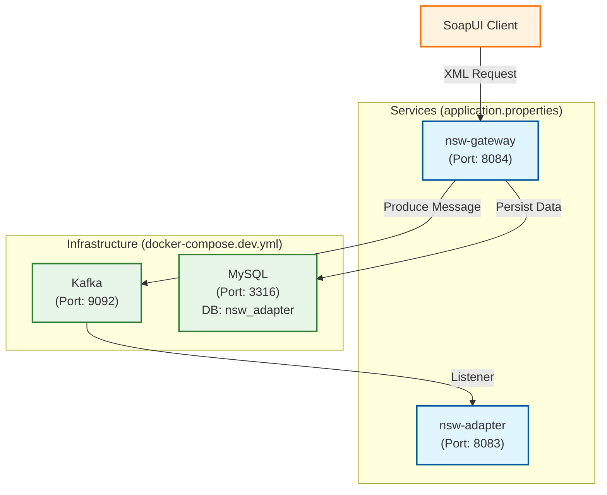
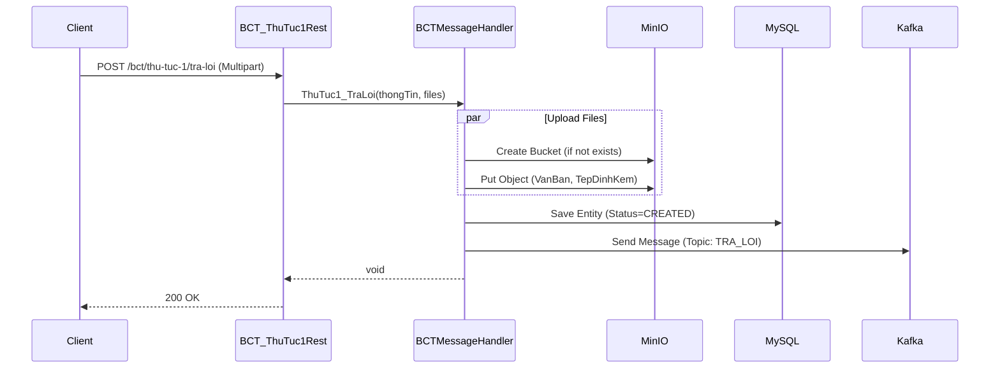

# Mô hình giao tiếp (Communication Model)

Mô tả luồng dữ liệu giữa các dịch vụ trong hệ thống:



### Luồng xử lý REST API (REST API Flow)
Chi tiết luồng xử lý bản tin REST API tại `nsw-gateway` (VD: API `tra-loi`):



# Hướng dẫn phát triển dự án NSW

Tài liệu này hướng dẫn chi tiết cách cài đặt môi trường, chạy debug và sử dụng các công cụ phát triển cho dự án.

## 1. Cài đặt môi trường (Environment Setup)

Trước khi bắt đầu, hãy đảm bảo máy tính của bạn đã cài đặt các công cụ sau:

### 1.1. Java Development Kit (JDK)
*   **Phiên bản**: Java 21
*   **Tải xuống**: [Adoptium Temurin 21](https://adoptium.net/) hoặc Oracle JDK 21.
*   **Kiểm tra**:
    ```bash
    java -version
    ```

### 1.2. Docker & Docker Compose
*   **Docker Desktop**: Tải và cài đặt từ [Docker Hub](https://www.docker.com/products/docker-desktop).
*   **Kiểm tra**:
    ```bash
    docker --version
    docker-compose --version
    ```

### 1.3. Maven (Tùy chọn)
*   Dự án thường sử dụng Maven Wrapper (`mvnw`), nhưng bạn có thể cài đặt Maven 3.9+ nếu muốn dùng global command.

---

## 2. Khởi chạy môi trường (Launch Environment)

Sử dụng `docker-compose` để khởi chạy các dịch vụ phụ trợ (Database, Kafka, MinIO).

### Lệnh khởi chạy
Tại thư mục gốc của dự án, chạy lệnh:

```bash
docker-compose -f docker-compose.dev.yml up -d
```

### Thông tin dịch vụ
| Dịch vụ | Container Name | Port (Host:Container) | Thông tin đăng nhập (nếu có) |
| :--- | :--- | :--- | :--- |
| **Kafka (NSW)** | `nsw-kafka` | `9092:9092` | - |
| **Kafka (BCT)** | `bct-kafka` | `9093:9092` | - |
| **MySQL (NSW)** | `nsw-mysql` | `3316:3306` | Root Pass: `rootpassword`, DB: `nsw_adapter` |
| **MySQL (BCT)** | `bct-mysql` | `3326:3306` | Root Pass: `rootpassword`, DB: `bct_adapter` |
| **MinIO** | `minio` | `9000:9000` (API), `9001:9001` (Console) | User: `minioadmin`, Pass: `minioadmin` |

---

## 3. Hướng dẫn Debug

### 3.1. Debug `nsw-gateway`

#### Cách 1: Command Line (Chạy trực tiếp)
```bash
cd nsw-gateway
mvn spring-boot:run
```
Lưu ý: Để debug qua CLI, bạn cần cấu hình JVM options (như `-agentlib:jdwp...`). Khuyên dùng IDE để thuận tiện hơn.

#### Cách 2: Visual Studio Code
1.  Mở tab **Run and Debug** (Ctrl+Shift+D).
2.  Chọn cấu hình **"NSW Gateway"** (đã được cấu hình trong `.vscode/launch.json`).
3.  Nhấn **F5** để bắt đầu debug.

#### Cách 3: IntelliJ IDEA
1.  Mở Project.
2.  Tạo Configuration mới -> chọn **Spring Boot**.
3.  Main class: `com.vn2bs.nsw_gateway.NswGatewayApplication`.
4.  Nhấn biểu tượng **Debug** (con bọ).

### 3.2. Debug `nsw-adapter`

#### Cách 1: Command Line
```bash
cd nsw-adapter
mvn spring-boot:run
```

#### Cách 2: Visual Studio Code
1.  Mở tab **Run and Debug**.
2.  Chọn cấu hình **"NSW Adapter"**.
3.  Nhấn **F5**.

#### Cách 3: IntelliJ IDEA
1.  Tạo Configuration mới -> chọn **Spring Boot**.
2.  Main class: `com.vn2bs.nsw_adapter.NswAdapterApplication`.
3.  Nhấn biểu tượng **Debug**.

---

## 4. Hướng dẫn Công cụ phát triển

### 4.1. Tạo Changelog với Liquibase
Dự án sử dụng Liquibase để quản lý version database. Để tạo changelog tự động từ sự thay đổi của entity:

1.  Đảm bảo database đang chạy.
2.  Chạy lệnh sau tại module tương ứng (`nsw-gateway`, `nsw-adapter`, v.v.):
    ```bash
    mvn liquibase:generateChangeLog
    ```
3.  File changelog mới sẽ được tạo tại đường dẫn được cấu hình trong `pom.xml` (thường là `src/main/resources/config/liquibase/changelog/`).

### 4.2. Tạo dữ liệu từ XSD với JAXB2
Để sinh các class Java từ file XSD (XML Schema Definition):

1.  Đảm bảo các file `.xsd` đã được đặt đúng vị trí (ví dụ: `src/main/resources/xsd/`).
2.  Chạy lệnh:
    ```bash
    mvn jaxb2:xjc
    ```
3.  Source code sẽ được gen vào thư mục cấu hình (ví dụ: `src/main/java`).

---

## 5. Cấu trúc dự án
*   **common**: Thư viện dùng chung.
*   **nsw-gateway**: Cổng giao tiếp xử lý nghiệp vụ hải quan.
*   **nsw-adapter**: Adapter kết nối với hệ thống hải quan.
*   **bct-gateway**: Cổng giao tiếp Bộ Công Thương.
*   **bct-adapter**: Adapter kết nối Bộ Công Thương.
