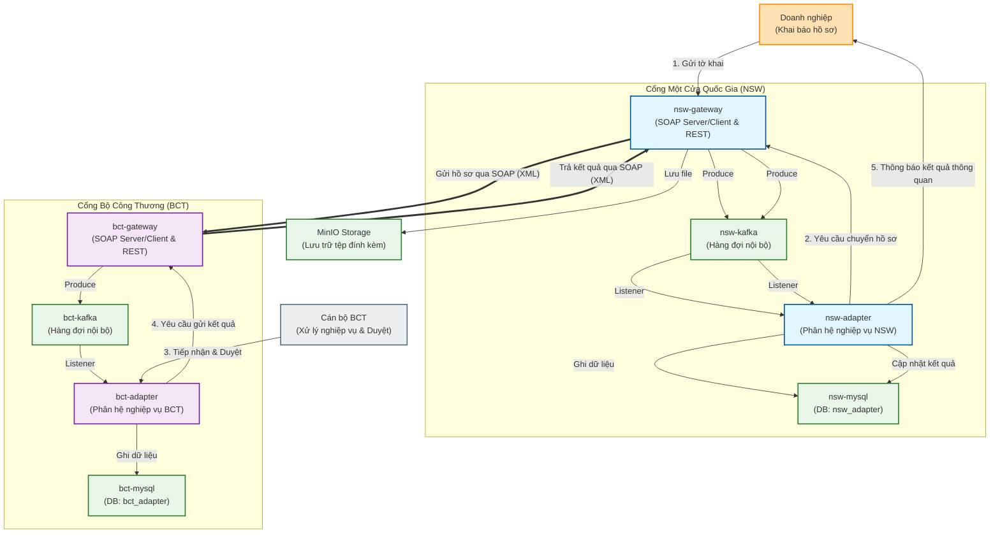
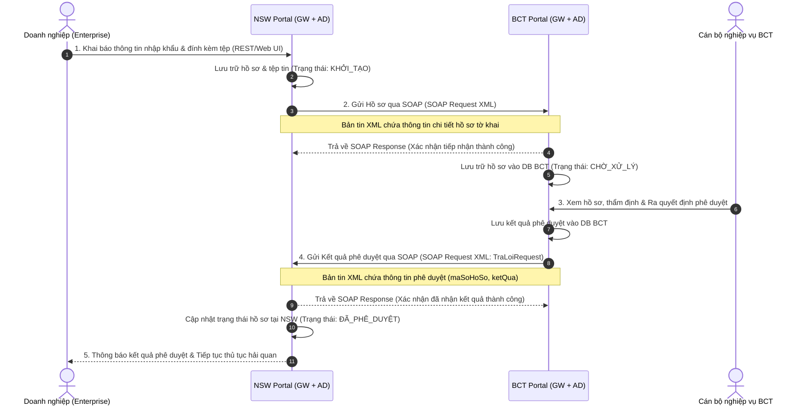

# Mô hình giao tiếp & Quy trình nghiệp vụ liên thông (Business Communication Model)

Hệ thống được thiết kế để mô phỏng quy trình nghiệp vụ liên thông hai chiều giữa **Cổng Một cửa Quốc gia (NSW Portal)** và **Cổng dịch vụ của Bộ/Ngành (ví dụ: Bộ Công Thương - BCT Portal)** để xử lý hồ sơ thủ tục hành chính.

## 1. Mô tả kịch bản nghiệp vụ liên thông

Quy trình phối hợp nghiệp vụ giữa Doanh nghiệp, NSW và BCT diễn ra như sau:
1. **Khai báo hồ sơ:** Doanh nghiệp truy cập cổng NSW thực hiện khai báo thông tin hồ sơ nhập khẩu và đính kèm các tệp tin (qua REST API/Web UI).
2. **Tiếp nhận & Chuyển tiếp hồ sơ:** Cổng NSW tiếp nhận, lưu trữ thông tin và tự động gửi thông tin hồ sơ sang cổng BCT bằng giao thức **SOAP (bản tin XML)** qua HTTP.
3. **Xử lý hồ sơ:** Cán bộ bên cổng BCT tiếp nhận hồ sơ, thực hiện kiểm tra nghiệp vụ trên phần mềm nghiệp vụ BCT và ra quyết định phê duyệt/từ chối.
4. **Trả kết quả xử lý:** Sau khi có kết quả phê duyệt, hệ thống BCT tự động gửi bản tin **SOAP (XML)** chứa kết quả xử lý quay trở lại cổng NSW.
5. **Thông quan hàng hóa:** Cổng NSW cập nhật trạng thái hồ sơ và trả kết quả cho Doanh nghiệp để tiếp tục thực hiện các thủ tục thông quan hải quan.

---

## 2. Mô hình kiến trúc kết nối giữa các Cổng và Phân hệ Nghiệp vụ

Dưới đây là mô hình chi tiết mô tả sự tương tác giữa các phần mềm nghiệp vụ bên trong và giao tiếp SOAP/XML giữa hai cổng:



---

## 3. Quy trình trao đổi bản tin SOAP/XML tuần tự (Sequence Flow)

Biểu đồ tuần tự dưới đây biểu diễn chi tiết các bước truyền nhận bản tin giữa hai cổng từ lúc doanh nghiệp khai báo cho tới khi nhận kết quả thông quan:



---

## 4. Đặc tả thông tin SOAP Endpoints & Cách kiểm thử nhanh

### Cấu hình SOAP Endpoints
| Cổng nhận | SOAP Endpoint | WSDL URL (Nginx/Dev) | Target Namespace | Request Payload |
| :--- | :--- | :--- | :--- | :--- |
| **NSW Gateway** | `/web-services/bct-thu-tuc-1` | `http://localhost/nsw-gateway/web-services/bct-thu-tuc-1.wsdl` | `thutuc1.bct.xsd.nsw_gateway.vn2bs.com` | `<TraLoiRequest>` |
| **NSW Gateway** | `/web-services/bct-messages` | `http://localhost/nsw-gateway/web-services/bct-messages.wsdl` | `com.vn2bs.webservices.bct.messages` | - |

### Ví dụ bản tin SOAP/XML gửi kết quả phê duyệt từ BCT sang NSW
Để giả lập cổng **BCT** gửi kết quả phê duyệt sang **NSW** (bước số 4 trong quy trình nghiệp vụ), bạn có thể chạy lệnh `cURL` sau:

```bash
curl -X POST \
  http://localhost/nsw-gateway/web-services \
  -H "Content-Type: text/xml" \
  -d '<soapenv:Envelope xmlns:soapenv="http://schemas.xmlsoap.org/soap/envelope/" xmlns:tns="thutuc1.bct.xsd.nsw_gateway.vn2bs.com">
   <soapenv:Header/>
   <soapenv:Body>
      <tns:TraLoiRequest>
         <tns:maSoHoSo>BCT-2026-0001</tns:maSoHoSo>
         <tns:ketQua>Phe duyet ho so thanh cong. Du dieu kien thong quan.</tns:ketQua>
      </tns:TraLoiRequest>
   </soapenv:Body>
</soapenv:Envelope>'
```

**Bản tin phản hồi thành công nhận được từ NSW (SOAP Response):**

```xml
<SOAP-ENV:Envelope xmlns:SOAP-ENV="http://schemas.xmlsoap.org/soap/envelope/">
   <SOAP-ENV:Header/>
   <SOAP-ENV:Body>
      <ns2:TraLoiResponse xmlns:ns2="thutuc1.bct.xsd.nsw_gateway.vn2bs.com">
         <ns2:maSoHoSo>BCT-2026-0001</ns2:maSoHoSo>
         <ns2:ketQua>success</ns2:ketQua>
      </ns2:TraLoiResponse>
   </soapenv:Body>
</SOAP-ENV:Envelope>
```

---

# Hướng dẫn phát triển dự án NSW

Tài liệu này hướng dẫn chi tiết cách cài đặt môi trường, chạy debug và sử dụng các công cụ phát triển cho dự án.

## 1. Cài đặt môi trường (Environment Setup)

Trước khi bắt đầu, hãy đảm bảo máy tính của bạn đã cài đặt các công cụ sau:

### 1.1. Java Development Kit (JDK)
*   **Phiên bản**: Java 21
*   **Tải xuống**: [Adoptium Temurin 21](https://adoptium.net/) hoặc Oracle JDK 21.
*   **Kiểm tra**:
    ```bash
    java -version
    ```

### 1.2. Docker & Docker Compose
*   **Docker Desktop**: Tải và cài đặt từ [Docker Hub](https://www.docker.com/products/docker-desktop).
*   **Kiểm tra**:
    ```bash
    docker --version
    docker-compose --version
    ```

### 1.3. Maven (Tùy chọn)
*   Dự án thường sử dụng Maven Wrapper (`mvnw`), nhưng bạn có thể cài đặt Maven 3.9+ nếu muốn dùng global command.

---

## 2. Khởi chạy môi trường (Launch Environment)

Sử dụng `docker-compose` để khởi chạy các dịch vụ phụ trợ (Database, Kafka, MinIO).

### Lệnh khởi chạy
Tại thư mục gốc của dự án, chạy lệnh:

```bash
docker-compose -f docker-compose.dev.yml up -d
```

### Thông tin dịch vụ
| Dịch vụ | Container Name | Port (Host:Container) | Thông tin đăng nhập (nếu có) |
| :--- | :--- | :--- | :--- |
| **Kafka (NSW)** | `nsw-kafka` | `9092:9092` | - |
| **Kafka (BCT)** | `bct-kafka` | `9093:9092` | - |
| **MySQL (NSW)** | `nsw-mysql` | `3316:3306` | Root Pass: `rootpassword`, DB: `nsw_adapter` |
| **MySQL (BCT)** | `bct-mysql` | `3326:3306` | Root Pass: `rootpassword`, DB: `bct_adapter` |
| **MinIO** | `minio` | `9000:9000` (API), `9001:9001` (Console) | User: `minioadmin`, Pass: `minioadmin` |

---

## 3. Hướng dẫn Debug

### 3.1. Debug `nsw-gateway`

#### Cách 1: Command Line (Chạy trực tiếp)
```bash
cd nsw-gateway
mvn spring-boot:run
```
Lưu ý: Để debug qua CLI, bạn cần cấu hình JVM options (như `-agentlib:jdwp...`). Khuyên dùng IDE để thuận tiện hơn.

#### Cách 2: Visual Studio Code
1.  Mở tab **Run and Debug** (Ctrl+Shift+D).
2.  Chọn cấu hình **"NSW Gateway"** (đã được cấu hình trong `.vscode/launch.json`).
3.  Nhấn **F5** để bắt đầu debug.

#### Cách 3: IntelliJ IDEA
1.  Mở Project.
2.  Tạo Configuration mới -> chọn **Spring Boot**.
3.  Main class: `com.vn2bs.nsw_gateway.NswGatewayApplication`.
4.  Nhấn biểu tượng **Debug** (con bọ).

### 3.2. Debug `nsw-adapter`

#### Cách 1: Command Line
```bash
cd nsw-adapter
mvn spring-boot:run
```

#### Cách 2: Visual Studio Code
1.  Mở tab **Run and Debug**.
2.  Chọn cấu hình **"NSW Adapter"**.
3.  Nhấn **F5**.

#### Cách 3: IntelliJ IDEA
1.  Tạo Configuration mới -> chọn **Spring Boot**.
2.  Main class: `com.vn2bs.nsw_adapter.NswAdapterApplication`.
3.  Nhấn biểu tượng **Debug**.

---

## 4. Hướng dẫn Công cụ phát triển

### 4.1. Tạo Changelog với Liquibase
Dự án sử dụng Liquibase để quản lý version database. Để tạo changelog tự động từ sự thay đổi của entity:

1.  Đảm bảo database đang chạy.
2.  Chạy lệnh sau tại module tương ứng (`nsw-gateway`, `nsw-adapter`, v.v.):
    ```bash
    mvn liquibase:generateChangeLog
    ```
3.  File changelog mới sẽ được tạo tại đường dẫn được cấu hình trong `pom.xml` (thường là `src/main/resources/config/liquibase/changelog/`).

### 4.2. Tạo dữ liệu từ XSD với JAXB2
Để sinh các class Java từ file XSD (XML Schema Definition):

1.  Đảm bảo các file `.xsd` đã được đặt đúng vị trí (ví dụ: `src/main/resources/xsd/`).
2.  Chạy lệnh:
    ```bash
    mvn jaxb2:xjc
    ```
3.  Source code sẽ được gen vào thư mục cấu hình (ví dụ: `src/main/java`).

---

## 5. Cấu trúc dự án
*   **common**: Thư viện dùng chung.
*   **nsw-gateway**: Cổng giao tiếp xử lý nghiệp vụ hải quan.
*   **nsw-adapter**: Adapter kết nối với hệ thống hải quan.
*   **bct-gateway**: Cổng giao tiếp Bộ Công Thương.
*   **bct-adapter**: Adapter kết nối Bộ Công Thương.
